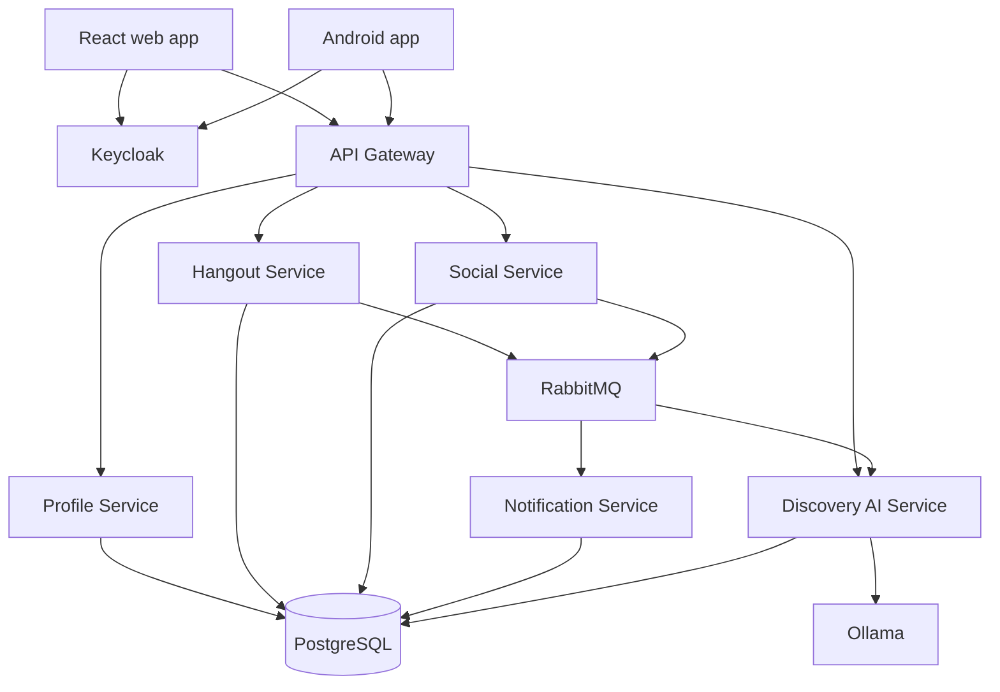

# Container view

The word “container” here means both a deployable application boundary and,
locally, the corresponding Docker container.

## Access rules

- Clients interact directly with Keycloak only for standard identity flows.
- Business API traffic enters through the gateway.
- Ollama is internal and is called only by the AI service.
- A single local PostgreSQL process may host isolated service databases.
- Asynchronous consumers tolerate redelivery and process messages idempotently.

